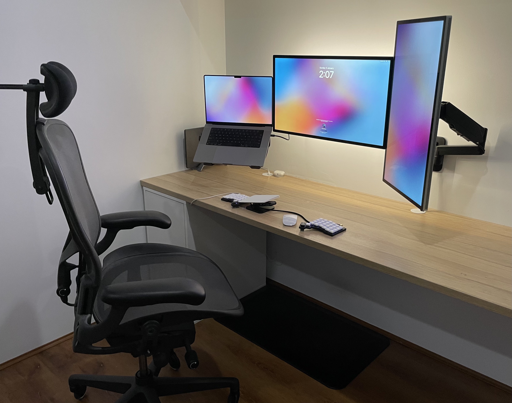
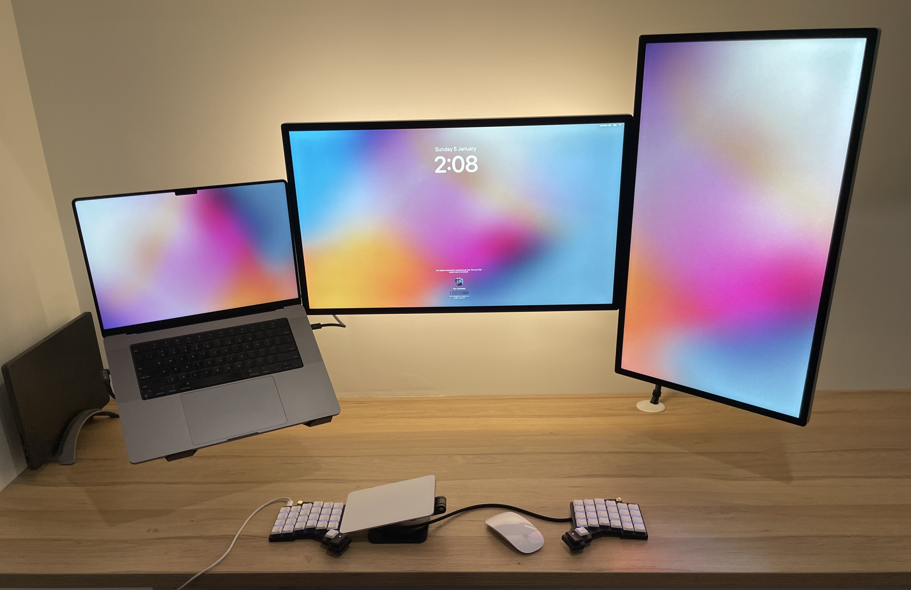

# Office Setup

Since working from home I've been upgrading my office setup with an emphasis on ergonomics. I believe in investing in high quality tools to make time spent working and studying more productive and enjoyable.

 {: .center width="900px" height="900px"}

## Equipment (January 2025)

### Laptop

- Work: Macbook Pro 16" (M2 Pro)
- Personal: Macbook Pro 14" (M4 Max)

The Apple ARM processors are workhorses and I opt to use the high quality retina display as an additional monitor.

### Monitor

- 2x Apple Studio Displays

I spent a long time researching monitors and eventually ended up with ASD for the following reasons:

1. The screen is primarily used for productivity. I spend the majority of my time in a terminal or IDE so picture quality, text sharpness, and brightness are my primary concerns.
2. There are limited 5K/6K monitor options on the market. These high resolutions both look great and allow macOS to scale efficiently.
3. When using the monitor with the MBP it wakes from sleep almost instantly, and you can control the monitor functions (brightness, volume) using the native macOS controls.
4. Integrated speakers, webcam, and 4 port dock. The speakers are great considering they are built into the monitor. The webcam not so much, but it's still fine for day-to-day use. 
5. Apple support is second to none. I've heard nightmare stories trying to get support from Samsung, LG etc.

On the rear of the ASD I've added a [LED light strip](https://www.amazon.com.au/PAUTIX-Dimmable-Backlight-Flexible-Lighting/dp/B0B1J57XS9?th=1) for back lighting. This provides excellent relief from eye strain and I would recommend additional lighting for anyone working late at night.

### Monitor Mount 

- Brateck dual wall mount (monitors)
- Brateck single wall mount ([laptop tray](https://www.ebay.com.au/itm/174574651488))

The desk is flush with the wall (it's an IKEA kitchen benchtop) so I use wall mounted monitor arms.

 {: .center width="900px" height="900px"}

### Headphones

- AirPods Pro

Active noise cancellation is a must when working from home or a busy office. The battery life, sound quality, and portability mean they are my go-to headphones for both work and study.

### Input

- ZSA Voyager keyboard
    - Lowprokb Ambients Twilight switches
    - Lowprokb DDC choc keycaps
    - Kingcables TRRS cable
- Apple magic trackpad and mouse

I'm a fan of split keyboards as they allow the wrists and shoulders to stay in a more natural position. My first keyboard was a Dygma Raise; however, I switched to the Voyager due to it's simplicity, portability, and great software. Here is my [current layout](https://configure.zsa.io/voyager/layouts/Advee/latest/0).

> For anyone starting with a split/ergo keyboard, I highly recommend [monkeytype](https://monkeytype.com) for getting your touch typing back up to speed. There's some great funbox modes which can hit any weak points in your typing game. I personally like the wiki mode which gives a more real-world typing test.

### Chair

- Hermon Miller Aeron remastered edition size C 
    - Atlas headrest
    - Rollerblade wheels 

Aerons are a gold standard in the ergonomic chair world due to their level of customisation. I found the post in this [Reddit thread](https://www.reddit.com/r/Ergonomics/comments/q6xmju/ive_been_having_a_lot_of_neck_and_back_pain_im/) by a HM product manager to be the most useful explanation of how to properly set up the chair. I typically use it with the tilt adjuster unlocked (for that floating feeling) in a 90 degree upright position. I mainly use the headrest as a guide to feel where my head and neck should be to try and limit [forward head posture](https://www.physio-pedia.com/Forward_Head_Posture), rather than to support my head.

### Accessories

- Twelve South BookArc to hold and charge which ever laptop isn't currently in use
- Apple MagSafe charger for charging the AirPods or phone

